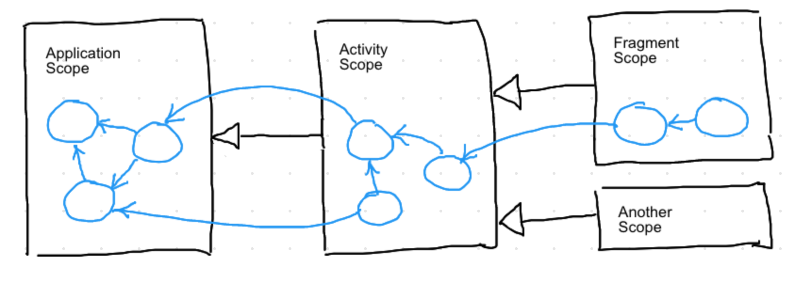

[](https://travis-ci.org/beworker/magnet)
[](http://kotlinlang.org/)
[](http://www.apache.org/licenses/LICENSE-2.0)


<hr1> 

Magnet is a concise dependency injection and [dependency inversion][1] library for Android, designed for highly modular applications. Magnet operates on hierarchical dependency scopes where a child scope extends its parent scope by keeping a reference to it.



An instance is typically injected within a scope. Instance can depend on other instances whithin the same or a parent scope. Magnet will take care for injecting and keeping the instance in the right scope, where all required instance dependencies can be satisfied. Thus you don't have to declare any modules and componets, and then bind them together. You just define dependencies in your class constructor, optionally declare how to scope the instance and Magnet will do the rest. 

Here is a slightly simplified example of how Magnet would build Dagger's coffe maker.

```kotlin
@Instance(type = Pump::class)
class Thermosiphon(private val heater: Heater) : Pump

@Instance(type = Heater::class)
class ElectricHeater(): Heater

@Instance(type = CoffeMaker::class)
class CoffeeMaker(
   private val heater: Heater,
   private val pump: Pump
)

val scope = Magnet.createScope()
val coffeMaker: CoffeeMaker = scope.getSingle()
```

This desing makes dependency injection so easy that it becomes hard not to use it.

# Unique features

1. Magnet does not force you to use any generated classes in your code. This dramatically improves user experience when code does not compile due to an error. Delevoper will see a single error at a single location and not hundreds of errors at all places, where generated code is referenced. If you used dagger, you know what I mean. 

2. Magnet is capable of injecting annotated classes from **compiled** libraries. This means you can extend funtionality of your application by just adding libraries as a dependency to the compilation. No source modification is necessary. See how [magnetx-app-leakcanary](magnet-extensions/magnetx-app-leakcanary) and [magnetx-app-rxandroid](magnet-extensions/magnetx-app-rxandroid) leverage this feature.

3. Magnet has a concept of extensible declarative selectors, which gives you additional control over when instances should be injected and when not. The example down below injects `AudioFocusImplLegacy` implementation of `AudioFocus` interface, if current Android API level is less than 26 and `AudioFocusImpl26` one otherwise.

```kotlin
interface AudioFocus

@Instance(
    type = AudioFocus::class,
    selector = "android.api < 26"
)
internal class AudioFocusLegacy : AudioFocus

@Instance(
    type = AudioFocus::class,
    selector = "android.api >= 26"
)
internal class AudioFocusV26: AudioFocus

val scope = Magnet.createScope()
val audioFocus: AudioFocus = scope.getSingle()
```

Custom selectors are easy to write. For more details checkout [magnetx-selector-android](magnet-extensions/magnetx-selector-android) or [magnetx-selector-features](magnet-extensions/magnetx-selector-features) modules.

# Documentation

1. [Developer Guide](https://www.halfbit.de/magnet/developer-guide/)
2. [Dependency Inversion][1]
3. [Hierarchical Scopes][2]

# Gradle

Kotlin
```gradle
dependencies {
    api 'de.halfbit:magnet-kotlin:2.5'
    kapt 'de.halfbit:magnet-processor:2.5'
}
```

Java
```gradle
dependencies {
    api 'de.halfbit:magnet:2.5'
    annotationProcessor 'de.halfbit:magnet-processor:2.5'
}
```

# Proguard & R8
```proguard 
-keep class magnet.internal.MagnetIndexer { *; }
```

# Support

Magnet is provided for free, without any support. If you consider using Magnet in your commercial product and you need support or training, feel free to <a href="mailto:info@halfbit.de?subject=Magnet,%20Technical%20support">contact me</a>.

# License
```
Copyright 2018 Sergej Shafarenka, www.halfbit.de

Licensed under the Apache License, Version 2.0 (the "License");
you may not use this file except in compliance with the License.
You may obtain a copy of the License at

   http://www.apache.org/licenses/LICENSE-2.0

Unless required by applicable law or agreed to in writing, software
distributed under the License is distributed on an "AS IS" BASIS,
WITHOUT WARRANTIES OR CONDITIONS OF ANY KIND, either express or implied.
See the License for the specific language governing permissions and
limitations under the License.
```

[1]: https://github.com/beworker/magnet/wiki/Dependency-inversion
[2]: https://github.com/beworker/magnet/wiki/Dependency-auto-scoping
