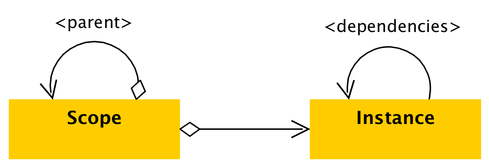

[](https://travis-ci.org/beworker/magnet)
[](http://kotlinlang.org/)
[](http://www.apache.org/licenses/LICENSE-2.0)

# Magnet

Magnet is a minimalistic dependency injection and dependency inversion framework for Android and Java. If you like the idea of grouping objects into hierarchical scopes, automatic transitive dependency injection and simple declarative configuration, then Magnet can be a good choice for you.

Magnet implements annotation processor which analyses your code and generates easy-to-read and easy-to-debug factories for your implementation classes. At the same time Magnet allows building modular applications, where dependencies can be injected dynamically at runtime (see [dependency inversion][1]). This dynamic behavior comes with its costs - Magnet cannot fully ensure consistency of the dependency-graph of your application at compile time. Nevertheless it does as much as possible at compile time and only the rest gets checked at runtime. If you prefer fully statical graph binding at compile time and you can resign on dynamic modularization and dependency inversion Magnet offers, you should rather go for Dagger2. You will also loose Magnet's configuration simplicity, but the choice is yours.

Magnet does not use reflection for objects creation. It generates and uses factories instead. By doing this Magnet stays fast and easy to debug. It also provides a very simple DSL when used with Kotlin. Magnet classes are well documented and covered by unit tests.

# Design
Magnet has a very minimalistic, almost naive, design. It deals with two concepts - `Scopes` and `Objects`. The whole design can be described by just four simple statements:

1. `Scopes` are containers for `Objects`.
2. `Scopes` can build up hierarchies.
2. `Objects` can be put into (bound) and taken from `Scopes`.
3. `Objects` can depend on each other.



# Getting started

1. Initializing Magnet. This step has to be done once for the main application module only. It allows Magnet to find all implementations located in main and library modules, which makes dependency inversion between modules possible.

```kotlin
@Magnetizer
interface AppMagnetizer
```

2. Write and annotate your implementation classes.

```kotlin
Repository.kt

interface Repository {
    fun getHelloMessage(): String
}

@Implementation(type = Repository::class)
inner class DefaultRepository(): Repository {
    override fun getHelloMessage() = "Hello Magnet!"
}
```

```kotlin
Presenter.kt

@Implementation(type = Presenter::class)
class Presenter(private val repository: Repository) {
    fun presentHelloMessage() {
        println(repository.getHelloMessage())
    }
}
```

3. Create scope and inject objects.

```kotlin
val root = Magnet.createScope()
val presenter = root.getSingle<Presenter>()

presenter.presentHelloMessage()
```

Magnet will create `Presenter` and `Repository` objects for you. 

# Documentation

1. Additional documentation and examples can be found in Javadoc.
2. [Dependency inversion][1]
3. [Dependency auto-scoping][2]

# Gradle

Kotlin
```gradle
dependencies {
    api "de.halfbit:magnet-kotlin:2.0-RC2"
    kapt "de.halfbit:magnet-processor:2.0-RC2"
}
```

Java
```gradle
dependencies {
    api 'de.halfbit:magnet:2.0-RC2'
    annotationProcessor 'de.halfbit:magnet-processor:2.0-RC2'
}
```

# License
```
Copyright 2018 Sergej Shafarenka, www.halfbit.de

Licensed under the Apache License, Version 2.0 (the "License");
you may not use this file except in compliance with the License.
You may obtain a copy of the License at

   http://www.apache.org/licenses/LICENSE-2.0

Unless required by applicable law or agreed to in writing, software
distributed under the License is distributed on an "AS IS" BASIS,
WITHOUT WARRANTIES OR CONDITIONS OF ANY KIND, either express or implied.
See the License for the specific language governing permissions and
limitations under the License.
```

[1]: https://github.com/beworker/magnet/wiki/Dependency-inversion
[2]: https://github.com/beworker/magnet/wiki/Dependency-auto-scoping
